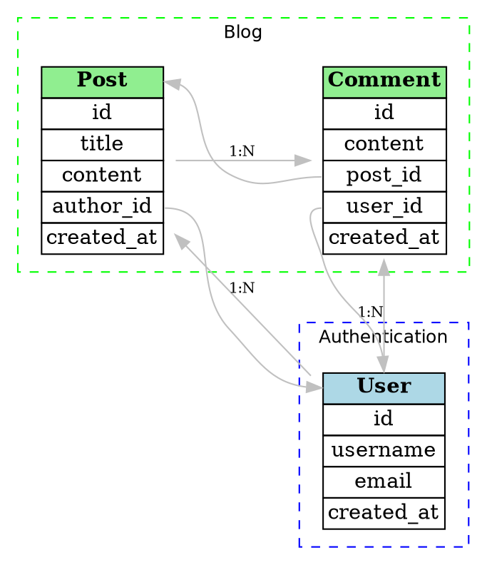
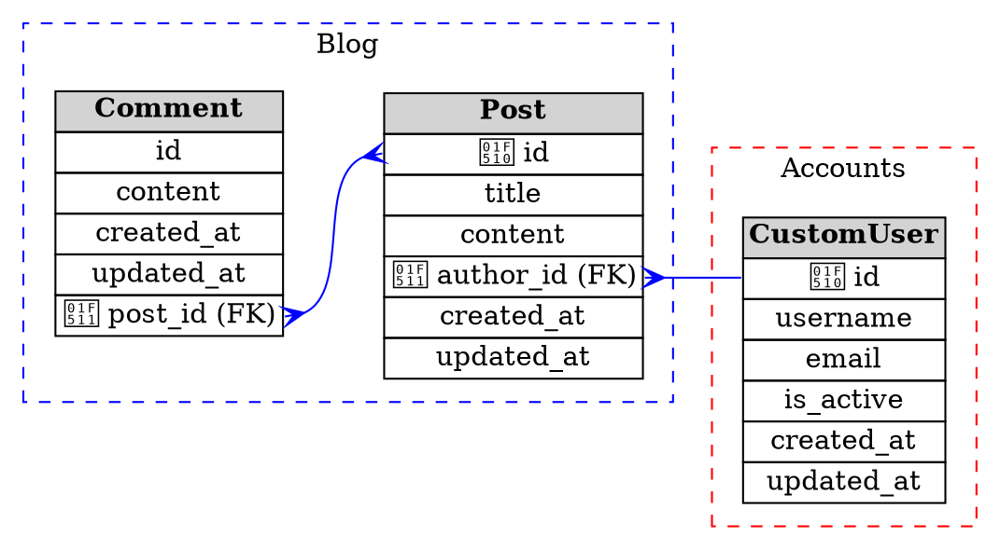

# Django용 앱 기반 ERD 만들기 - Graphviz DOT 언어 튜토리얼

## 목차

1. [소개](#introduction)
2. [기본 구조](#basic-structure)
3. [그래프 속성 설정](#graph-attributes)
4. [노드 정의](#node-definition)
   - [테이블 노드 만들기](#creating-table-nodes)
   - [포트 사용하기](#using-ports)
5. [에지 정의](#edge-definition)
   - [관계 표현하기](#representing-relationships)
   - [에지 스타일 설정](#edge-style)
6. [서브그래프 활용](#subgraphs)
   - [앱 별로 그룹화하기](#grouping-by-app)
   - [서브그래프 스타일 설정](#subgraph-style)
7. [주석 및 레이블 추가](#comments-and-labels)
8. [라이브 테스트](#live-testing)
9. [예시 코드](#example-code)
10. [결론](#conclusion)

## 소개<a name="introduction"></a>

Graphviz는 그래프를 시각화하기 위한 강력한 오픈 소스 도구입니다. DOT 언어를 사용하여 그래프를 정의하고, 이를 통해 다양한 형식의 다이어그램을 생성할 수 있습니다. 이 튜토리얼에서는 Django 앱의 ERD(Entity-Relationship Diagram)를 만드는 데 초점을 맞출 것입니다. 예시 코드를 통해 DOT 언어의 주요 기능과 구문을 설명하고, 예쁜 ERD를 만드는 방법을 단계별로 알아보겠습니다.

## 기본 구조<a name="basic-structure"></a>

DOT 언어로 ERD를 정의하려면 `digraph` 키워드를 사용하여 방향 그래프를 선언해야 합니다. 그래프의 이름은 중괄호(`{}`) 안에 지정합니다.

```dot
digraph AppSchema {
  // 그래프 정의
}
```

## 그래프 속성 설정<a name="graph-attributes"></a>

그래프의 속성을 설정하여 ERD의 레이아웃과 스타일을 조정할 수 있습니다. 다음은 몇 가지 유용한 속성입니다:

- `rankdir`: 노드의 배치 방향을 설정합니다. 예를 들어, `rankdir=LR`은 노드를 왼쪽에서 오른쪽으로 배치합니다.
- `nodesep`: 노드 간의 수직 간격을 설정합니다.
- `ranksep`: 랭크(레벨) 간의 수직 간격을 설정합니다.
- `fontname`: 그래프에서 사용할 글꼴을 설정합니다.
- `fontsize`: 그래프에서 사용할 글꼴 크기를 설정합니다.

```dot
digraph AppSchema {
  rankdir=LR;
  nodesep=0.5;
  ranksep=1.0;
  fontname="Helvetica";
  fontsize=12;
  // ...
}
```

## 노드 정의<a name="node-definition"></a>

노드는 ERD에서 테이블을 나타냅니다. 노드를 정의할 때는 테이블의 이름과 속성을 지정합니다.

### 테이블 노드 만들기<a name="creating-table-nodes"></a>

테이블 노드를 만들 때는 HTML과 유사한 구문을 사용하여 노드의 레이블을 정의할 수 있습니다. `<table>` 태그를 사용하여 테이블 모양의 노드를 만들고, `<tr>`과 `<td>`를 사용하여 행과 셀을 정의합니다.

```dot
User [label=<<table border="0" cellborder="1" cellspacing="0">
  <tr><td bgcolor="lightblue"><b>User</b></td></tr>
  <tr><td>id</td></tr>
  <tr><td>username</td></tr>
  <tr><td>email</td></tr>
  <tr><td>created_at</td></tr>
</table>>];
```

위의 코드는 "User" 테이블을 나타내는 노드를 정의합니다. 테이블의 이름은 첫 번째 행에 굵은 글씨로 표시되고, 각 속성은 별도의 행에 표시됩니다.

### 포트 사용하기<a name="using-ports"></a>

포트를 사용하여 노드의 특정 부분에 연결점을 지정할 수 있습니다. 이는 외래 키 관계를 표현할 때 유용합니다. `port` 속성을 사용하여 포트에 이름을 할당하고, 에지 정의에서 해당 포트를 참조할 수 있습니다.

```dot
Post [label=<<table border="0" cellborder="1" cellspacing="0">
  <tr><td port="id"><b>Post</b></td></tr>
  <tr><td>id</td></tr>
  <tr><td>title</td></tr>
  <tr><td port="author_id">author_id</td></tr>
</table>>];
```

위의 코드에서는 "Post" 테이블의 "id"와 "author_id" 속성에 포트를 할당했습니다.

## 에지 정의<a name="edge-definition"></a>

에지는 노드 간의 관계를 나타냅니다. ERD에서는 외래 키 관계를 표현하는 데 사용됩니다.

### 관계 표현하기<a name="representing-relationships"></a>

에지를 정의할 때는 `->` 기호를 사용하여 관계의 방향을 나타냅니다. 외래 키 관계를 표현할 때는 포트를 사용하여 정확한 연결점을 지정할 수 있습니다.

```dot
User -> Post [label="1:N"];
Post:author_id -> User:id;
```

위의 코드는 "User"와 "Post" 테이블 간의 일대다(1:N) 관계를 나타냅니다. "Post" 테이블의 "author_id" 포트와 "User" 테이블의 "id" 포트를 연결하여 외래 키 관계를 표현했습니다.

### 에지 스타일 설정<a name="edge-style"></a>

에지의 스타일을 설정하여 관계를 시각적으로 강조할 수 있습니다. `edge` 키워드를 사용하여 에지의 기본 스타일을 설정하고, 개별 에지에 대한 스타일을 지정할 수도 있습니다.

```dot
edge [color=gray, fontcolor=black, fontsize=10];
User -> Post [label="1:N", color=blue, fontcolor=blue];
```

위의 코드는 에지의 기본 스타일을 회색으로 설정하고, "User"와 "Post" 간의 관계를 파란색으로 강조했습니다.

## 서브그래프 활용<a name="subgraphs"></a>

서브그래프를 사용하여 관련된 노드를 그룹화하고 시각적으로 구분할 수 있습니다.

### 앱 별로 그룹화하기<a name="grouping-by-app"></a>

Django 프로젝트에서는 앱 별로 테이블을 그룹화하는 것이 일반적입니다. `subgraph` 키워드를 사용하여 앱 별로 서브그래프를 정의할 수 있습니다.

```dot
subgraph cluster_auth {
  label="Authentication";
  color=blue;

  User;
  Group;
  Permission;
}

subgraph cluster_blog {
  label="Blog";
  color=green;

  Post;
  Comment;
  Category;
}
```

위의 코드는 "Authentication"과 "Blog" 앱에 해당하는 서브그래프를 정의합니다. 각 서브그래프는 해당 앱의 테이블 노드를 포함합니다.

### 서브그래프 스타일 설정<a name="subgraph-style"></a>

서브그래프의 스타일을 설정하여 앱 간의 구분을 명확히 할 수 있습니다. `color`, `style`, `fontname`, `fontsize` 등의 속성을 사용하여 서브그래프의 모양을 조정할 수 있습니다.

```dot
subgraph cluster_auth {
  label="Authentication";
  color=blue;
  style=dashed;
  fontname="Helvetica";
  fontsize=12;
  // ...
}
```

## 주석 및 레이블 추가<a name="comments-and-labels"></a>

주석과 레이블을 추가하여 ERD를 더욱 정보적으로 만들 수 있습니다.

- 주석: `//`를 사용하여 한 줄 주석을 추가할 수 있습니다.
- 레이블: `label` 속성을 사용하여 노드와 에지에 레이블을 추가할 수 있습니다.

```dot
// User 테이블
User [label=<<table border="0" cellborder="1" cellspacing="0">
  <tr><td bgcolor="lightblue"><b>User</b></td></tr>
  <tr><td>id</td></tr>
  <tr><td>username</td></tr>
  <tr><td>email</td></tr>
  <tr><td>created_at</td></tr>
</table>>];

// User와 Post 간의 관계
User -> Post [label="1:N"];
```

## 라이브 테스트<a name="live-testing"></a>

DOT 언어로 ERD를 만들 때는 라이브 테스트 도구를 사용하는 것이 좋습니다. [https://viz-js.com/](https://viz-js.com/)에서 실시간으로 DOT 코드를 테스트하고 시각화된 결과를 확인할 수 있습니다. 코드를 수정하면서 ERD가 어떻게 변경되는지 즉시 확인할 수 있어 편리합니다. 맨 아래의 예시 코드를 GPT나 클로드에 붙여넣어 도움을 구하세요.

## 예시 코드<a name="example-code"></a>

아래는 Django 앱의 ERD를 만드는 예시 코드입니다. 이 코드를 기반으로 자신의 프로젝트에 맞게 수정하고 확장할 수 있습니다.



위의 코드는 "Authentication"과 "Blog" 앱의 ERD를 나타냅니다. 각 앱은 서브그래프로 그룹화되어 있으며, 테이블 간의 관계는 에지로 표현되어 있습니다.



위의 코드는 "Blog"와 "Accounts" 앱의 ERD를 나타냅니다. 각 앱은 서브그래프로 그룹화되어 있으며, 테이블 간의 관계는 에지로 표현되어 있습니다.
