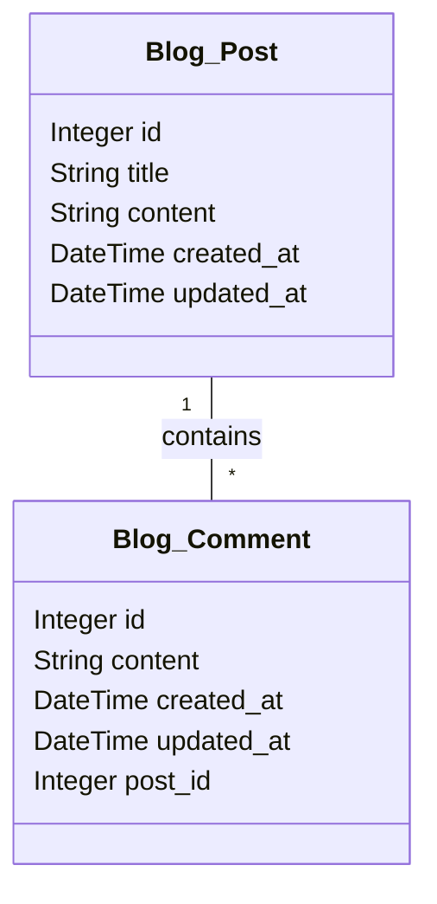

# Django Blog Post Model

이 글에서는 Django를 사용하여 블로그 애플리케이션을 만들 때 사용할 수 있는 블로그 포스트 모델에 대해 알아보겠습니다.

저런 느낌으로 위에다 달면 자동화가 됩니다.

```python
# blog > models.py

from django.db import models

class Post(models.Model):
    title = models.CharField(max_length=200)
    content = models.TextField()
    created_at = models.DateTimeField(auto_now_add=True)
    updated_at = models.DateTimeField(auto_now=True)

    def __str__(self):
        return self.title

class Comment(models.Model):
    post = models.ForeignKey(Post, on_delete=models.CASCADE, related_name='comments')
    content = models.TextField()
    created_at = models.DateTimeField(auto_now_add=True)
    updated_at = models.DateTimeField(auto_now=True)

    def __str__(self):
        return f'Comment by {self.id} on {self.post}'

```


