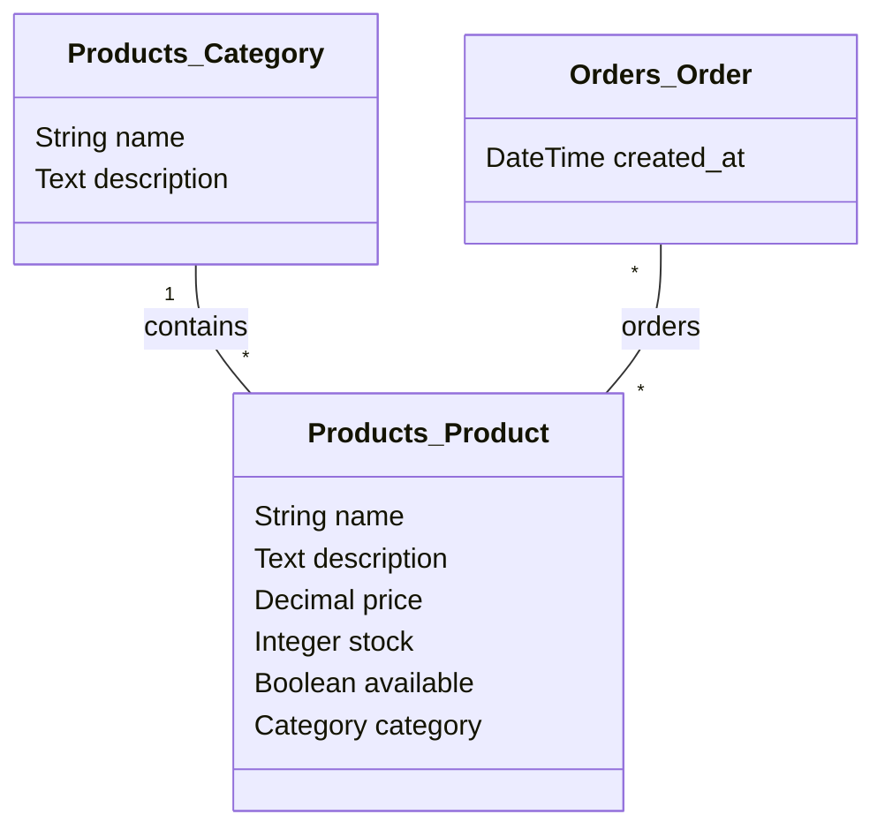

# Django Shopping Mall Product Model

이 글에서는 Django를 사용하여 쇼핑몰 애플리케이션을 개발할 때 사용할 수 있는 상품 모델에 대해 살펴보겠습니다.

...

```python
# product > models.py

from django.db import models

class Category(models.Model):
    name = models.CharField(max_length=255)
    description = models.TextField()

    def __str__(self):
        return self.name

class Product(models.Model):
    name = models.CharField(max_length=255)
    description = models.TextField()
    price = models.DecimalField(max_digits=10, decimal_places=2)
    stock = models.IntegerField()
    available = models.BooleanField(default=True)
    category = models.ForeignKey(Category, related_name='products', on_delete=models.CASCADE)

    def __str__(self):
        return self.name

```

```python
# order > models.py

from django.db import models
from Products.models import Product

class Order(models.Model):
    products = models.ManyToManyField(Product)
    created_at = models.DateTimeField(auto_now_add=True)

    def __str__(self):
        return f'Order {self.id} at {self.created_at}'

```


